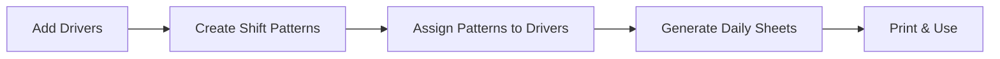

# Driver Shift Sheets 🚛

A comprehensive web application for managing driver scheduling with shift patterns and daily roster generation, built with Flask and SQLite.

## ✨ Features

### 🧑‍💼 **Driver Management**
- Add, edit, and manage basic driver information
- Vehicle type assignment (Standard, Estate, XL Estate, Minibus)  
- Driver attributes (School Badge, Pet Friendly)
- Clean separation of driver data and scheduling

### 🗓️ **Shift Pattern System**
- Create reusable shift patterns (7, 14, 21, 28-day cycles)
- Define daily shift types: Earlies, Days, Lates, Nights, Days Off  
- Visual pattern preview and management
- Assign patterns to drivers with date ranges

### 📋 **Daily Roster Generation**
- Generate who's working on any specific date
- Automatic shift type organization (Earlies/Days/Lates/Nights)
- Print-friendly daily sheets for dispatch/management
- 6AM operational day crossover support

### 🎨 **Modern Interface**
- **Responsive Design**: Works on desktop, tablet, and mobile devices
- **Clean Navigation**: Separate sections for Drivers, Shift Patterns, Daily Sheets
- **Professional UI**: Bootstrap 5 with intuitive workflow
- **Docker Support**: Easy deployment with containerization

## 🚀 Quick Start

### Option 1: Docker (Recommended)

```bash
# Clone the repository
git clone <your-repo-url>
cd shift-sheets

# Build and run with Docker Compose
docker compose up -d

# Access the application
open http://localhost:5000
```

### Option 2: Local Development

```bash
# Clone the repository
git clone <your-repo-url>
cd shift-sheets

# Create virtual environment
python3 -m venv venv
source venv/bin/activate  # On Windows: venv\Scripts\activate

# Install dependencies
pip install -r requirements.txt

# Run the application
python app.py

# Access the application
open http://localhost:5000
```

## 📖 How It Works

### 🎯 **3-Section Workflow**

#### 1️⃣ **Drivers** (`/drivers`)
- Add drivers with basic info only (no shift data!)
- Manage vehicle types and attributes
- View current pattern assignments
- Clean, focused driver management

#### 2️⃣ **Shift Patterns** (`/shifts`) 
- Create reusable shift rotation patterns
- Example: 7-day pattern [Earlies, Earlies, Days, Days, Lates, Off, Off]
- Assign patterns to drivers with start/end dates
- Visual pattern previews

#### 3️⃣ **Daily Sheets** (`/daily-sheet`)
- Pick any date to generate roster
- See which drivers work based on their assigned patterns
- Print professional daily sheets
- Organized by shift type for easy dispatch

### 🔄 **Example Workflow**



## ⚙️ Configuration

### Environment Variables

Create a `.env` file based on `.env.example`:

```bash
# Flask Configuration
FLASK_CONFIG=production  # development, production, or testing
FLASK_HOST=0.0.0.0
FLASK_PORT=5000
FLASK_DEBUG=false

# Security
SECRET_KEY=your-super-secret-key-here

# Database (optional, defaults to SQLite)
DATABASE_URL=sqlite:///data/shift-sheets.db

# Company Information
COMPANY_NAME=Your Company Name
```

### Database

The application uses SQLite by default, storing data in `data/shift-sheets.db`. For production, you can configure PostgreSQL or other databases via the `DATABASE_URL` environment variable.

## 🐳 Docker Deployment

### Docker Compose (Production)

```yaml
version: '3.8'
services:
  shift_web:
    build: .
    container_name: shift_web
    ports:
      - "5000:5000"
    volumes:
      - ./data:/app/data
    environment:
      - FLASK_CONFIG=production
      - SECRET_KEY=your-production-secret-key
      - COMPANY_NAME=Your Company Name
    restart: unless-stopped
```

### Standalone Docker

```bash
# Build image
docker build -t shift-sheets .

# Run container
docker run -d \
  --name shift-sheets \
  -p 5000:5000 \
  -v $(pwd)/data:/app/data \
  -e FLASK_CONFIG=production \
  -e SECRET_KEY=your-secret-key \
  -e COMPANY_NAME="Your Company" \
  shift-sheets
```

## 🛠️ Development

### Project Structure

```
shift-sheets/
├── app.py                      # Main Flask application
├── config.py                   # Configuration settings  
├── requirements.txt            # Python dependencies
├── Dockerfile                  # Docker container definition
├── docker-compose.yml          # Docker Compose configuration
├── .env.example               # Environment variables template
├── data/                      # Database storage
│   ├── .gitkeep
│   └── shift-sheets.db        # SQLite database
├── static/css/               # Styling
│   └── style.css
└── templates/                # HTML templates
    ├── base.html             # Base template with navigation
    ├── index.html            # Dashboard overview
    ├── drivers.html          # Driver management
    ├── add_driver.html       # Add driver form
    ├── shifts.html           # Shift pattern management  
    ├── add_shift_pattern.html # Create pattern form
    ├── assign_pattern.html    # Assign pattern to driver
    ├── daily_sheet_form.html  # Daily sheet generator
    ├── daily_sheet.html       # Daily roster view
    └── print_daily_sheet.html # Print-friendly sheets
```

### Database Schema

The application uses a clean 3-model structure:

```python
# Driver information (basic info only)
Driver:
  - id (Primary Key)
  - driver_number (Unique)
  - name  
  - car_type
  - school_badge (Boolean)
  - pet_friendly (Boolean)
  - created_at

# Reusable shift patterns  
ShiftPattern:
  - id (Primary Key)
  - name
  - description
  - cycle_length (days)
  - pattern_data (JSON: daily shift assignments)
  - created_at

# Links drivers to patterns with date ranges
DriverAssignment:
  - id (Primary Key)
  - driver_id (Foreign Key → Driver)
  - shift_pattern_id (Foreign Key → ShiftPattern)  
  - start_date
  - end_date (Optional)
  - created_at
```

## 🗂️ API Overview

### Main Routes

- **`GET /`** - Dashboard with today/tomorrow driver counts
- **`GET /drivers`** - Driver management 
- **`POST /driver/add`** - Add new driver
- **`GET /shifts`** - Shift pattern management
- **`POST /shift-pattern/add`** - Create new pattern
- **`GET /driver/<id>/assign-pattern`** - Assign pattern to driver
- **`GET /daily-sheet`** - Daily sheet generator form
- **`POST /daily-sheet/generate`** - Generate roster for specific date

## 🎯 Key Concepts

### Shift Types
- **Earlies** 🌅 - Early morning shifts
- **Days** ☀️ - Standard day shifts  
- **Lates** 🌆 - Late afternoon/evening shifts
- **Nights** 🌙 - Overnight shifts
- **Day Off** 💤 - Rest day

### Operational Day
- Uses **6AM crossover** - shifts before 6AM belong to previous operational day
- Ensures overnight shifts are properly categorized

### Pattern Assignment
- Multiple patterns can be assigned to the same driver over time
- Date ranges prevent conflicts
- New assignments automatically end previous ones

## 🤝 Contributing

1. Fork the repository
2. Create a feature branch (`git checkout -b feature/amazing-feature`)
3. Commit changes (`git commit -m 'Add amazing feature'`)
4. Push to branch (`git push origin feature/amazing-feature`)
5. Open a Pull Request

## 📄 License

This project is licensed under the MIT License - see the [LICENSE](LICENSE) file for details.

## 🆘 Support

For support, please open an issue on GitHub or contact your system administrator.

---

**Built with ❤️ for efficient driver scheduling and dispatch operations** 🚛✨